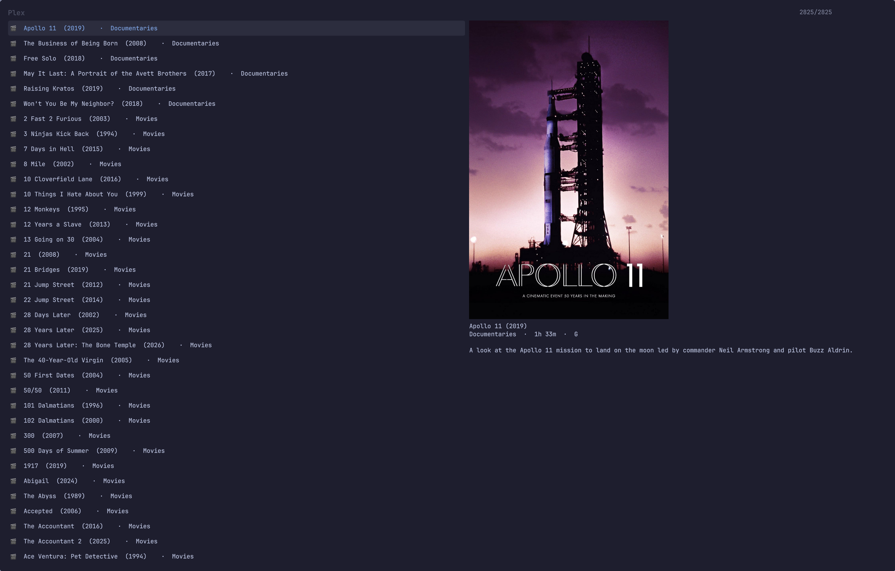

# Plex Float

Search your Plex library, play the result in a small window that floats above
everything and follows you from workspace to workspace. Made for
[Omarchy](https://omarchy.org/).

The picker shows poster art, the year, the runtime and the synopsis while you
type. Pick a show and it asks which episode.



## Install

```bash
omarchy plugin add https://github.com/jcputney/omarchy-media-float-plex.git --enable
~/.config/omarchy/plugins/io.github.jcputney.media-float-plex/setup
omarchy restart shell
```

The plugin and the command are separate halves, so there are two installers.
`omarchy plugin add` hands the shell the picker overlay. `setup` installs the
`plex-float` command, the window rules, and checks you have mpv.

The restart is the third line because the shell caches plugin QML once it has
loaded it — without it, the picker you just installed stays dark.

`setup --check` reports what is installed. `setup --uninstall` takes back
everything it wrote.

## Sign in

```bash
plex-float auth
```

This opens plex.tv in your browser and asks you to approve the sign-in. There is
no token to copy and paste. The token it receives is written to
`~/.config/plex-float/tokens` with mode 0600.

If you can reach more than one server:

```bash
plex-float server           # pick from the ones that answer
plex-float server --list    # show every address, and which of them respond
plex-float server --url http://192.168.1.10:32400
```

Servers are tried local address first, then remote, then Plex's relay, so you
get the fast path when you are on the same network as the server.

Already have a `~/.config/plex-float/config` with `PLEX_URL` and `PLEX_TOKEN`?
It still wins. Nothing overwrites it.

## Use it

```bash
plex-float search    # pick something and play it
plex-float index     # rebuild the library cache by hand
```

The library is cached, so the picker opens instantly on a big library. It
reindexes itself when the cache goes stale.

Add keybindings to `~/.config/hypr/bindings.lua` — `setup` prints these rather
than editing the file, because which keys are free is your business:

```lua
o.bind("SUPER + ALT + P", "Plex: search and play", "plex-float search")
o.bind("SUPER + ALT + SHIFT + P", "Overlay: hide/show", "float-overlay toggle")
o.bind("SUPER + ALT + CTRL + P", "Overlay: close", "float-overlay quit")
o.bind("SUPER + ALT + O", "Overlay: cycle size", "float-overlay size cycle")
```

`float-overlay` drives whichever overlay is up, so the same three keys work
for the Twitch and YouTube tools too.

While something is playing: `SUPER` + right-drag resizes the window freehand,
`SUPER + ALT + O` cycles it through four preset sizes, and the screen will not
blank or lock.

## Remove it

Two commands, mirroring the install:

```bash
~/.config/omarchy/plugins/io.github.jcputney.media-float-plex/setup --uninstall
omarchy plugin remove io.github.jcputney.media-float-plex
```

`setup --uninstall` removes the `plex-float` command, the shared `float-overlay`
command and library, `~/.config/hypr/media-float.lua`, and the marked block it
added to `hyprland.lua`. It leaves the shared pieces alone if another
media-float tool is still installed, and it never touches keybindings you added
yourself.

Your settings are deliberately left behind, so reinstalling does not make you
sign in again. Delete them yourself if you want them gone:

```bash
rm -rf ~/.config/plex-float
```

That directory holds your Plex token and server choice.

## Requirements

`mpv`, `jq`, `curl`, `hyprctl`, `socat`.

`fzf`, `chafa` and `ghostty` are optional. They are the fallback menu, used when
the shell plugin is disabled or you are not on Omarchy — the whole tool works
without the plugin, just in a terminal window instead of a native overlay.

## Related

- [omarchy-media-float-twitch](https://github.com/jcputney/omarchy-media-float-twitch)
- [omarchy-media-float-youtube](https://github.com/jcputney/omarchy-media-float-youtube)

Install any one of them on its own. Installed together they share the player
window, the overlay controls and the Hyprland rules.

## Licence

MIT.
